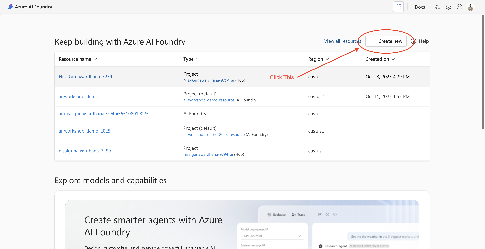
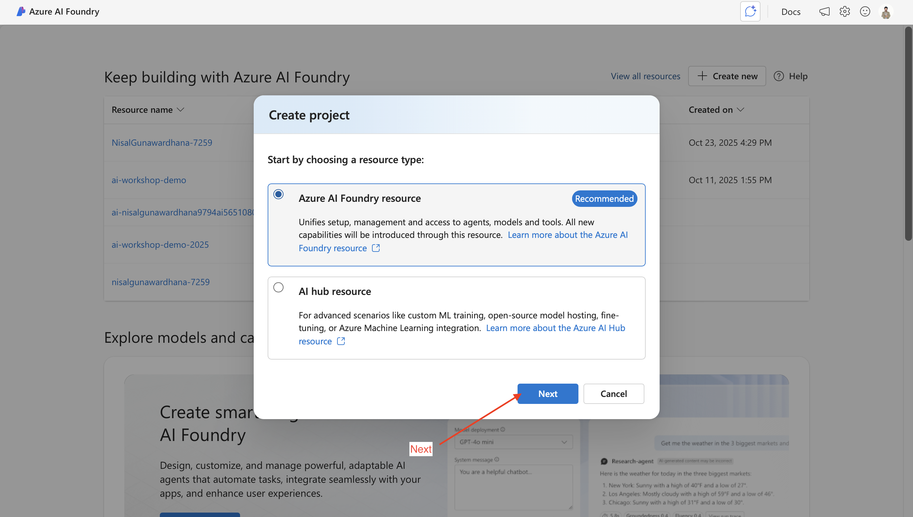
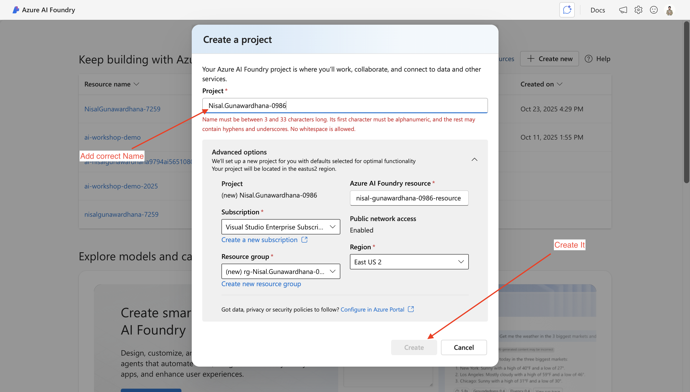
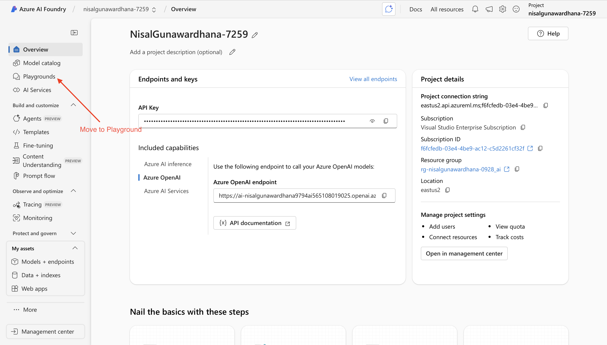
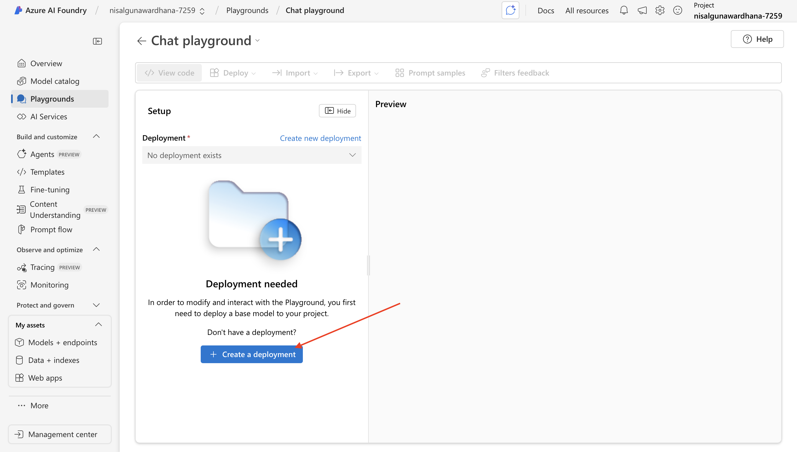
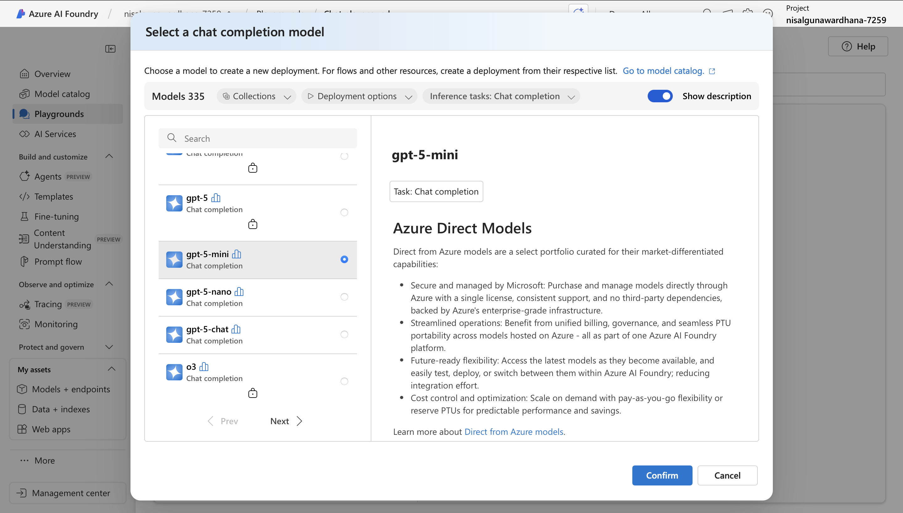
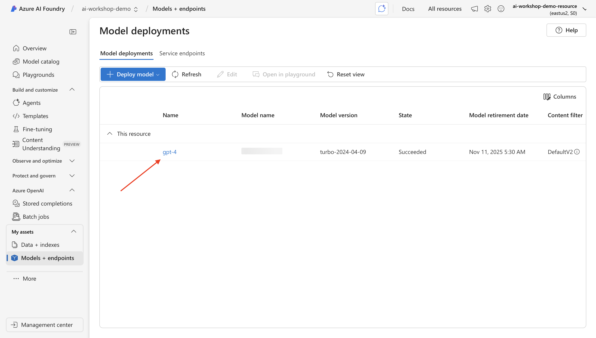
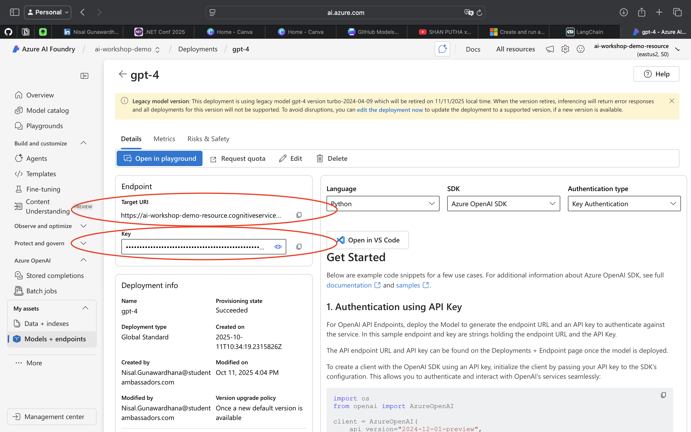
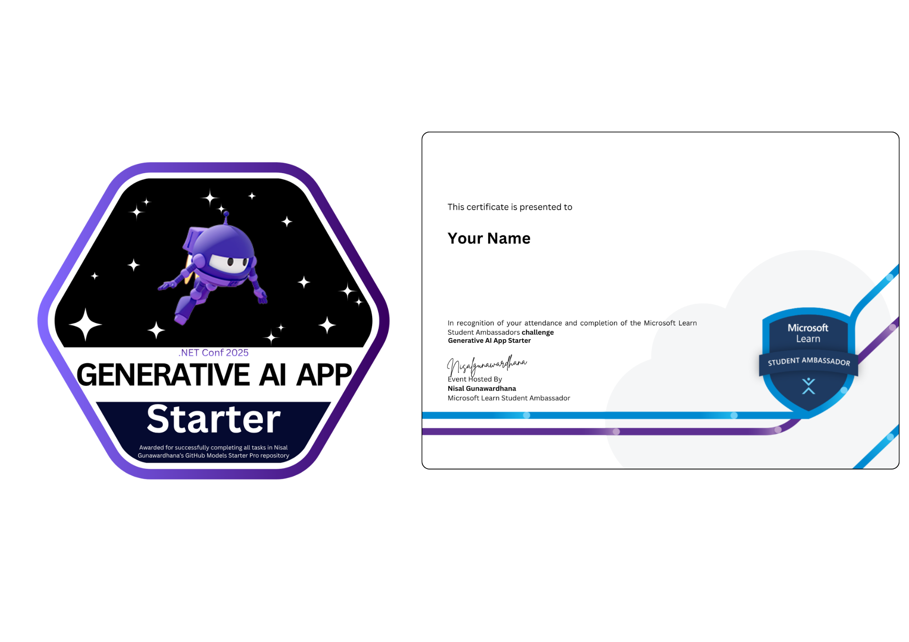

# GenAI Starter - .NET 

A concise collection of runnable .NET sample apps that demonstrate practical integration with GitHub Models and Azure AI Foundry. includes clear setup steps, environment configuration, and token/security guidance—ideal for learning, prototyping, and extending AI-enabled .NET applications.

[](https://github.com/nisalgunawardhana)

## Prerequisites

- .NET 9 SDK or later
- Git installed
- GitHub account
- Access to AI models — one of:
   - GitHub Models: a Personal Access Token with model access (https://github.com/settings/tokens)
   - Azure AI Foundry: an Azure subscription and a Foundry project with a deployed model and service credentials (endpoint + key or managed identity)


## Getting Started

### 1. Star and Fork this Repository
1. **Star this repository** ⭐ by clicking the "Star" button at the top of this page
2. **Fork this repository** by clicking the "Fork" button at the top of this page
3. This creates your own copy of the repository in your GitHub account

### 2. Clone Your Fork (Not the Original)
```bash
# Clone YOUR fork, not the original repository
git clone https://github.com/YOUR_USERNAME/GenAIStarter.git
cd GenAIStarter
```

### 3. Install .NET Dependencies
```bash
# Restore all project dependencies
dotnet restore

# Or build all projects (which also restores dependencies)
dotnet build
```

### 4. Setup Environment Configuration
1. **Create your .env file**:
   ```bash
   cp .env.example .env
   ```
   
2. **Add your API configuration to .env**:
   ```
   API_TOKEN=your_api_token_here
   API_ENDPOINT=https://models.github.ai/inference
   ```

### 5. Get Your API Token
You have two options for accessing models:

- GitHub-hosted models — use a personal access token with model access and point API_ENDPOINT to the GitHub inference URL; set API_TOKEN to the token.
- Azure Foundry — use your Foundry project’s endpoint and key (or managed identity); set API_ENDPOINT to the Foundry endpoint and API_TOKEN to the project key.

Example (.env)
```
API_ENDPOINT=https://models.github.ai/inference
API_TOKEN=your_api_token_here
```
Choose the provider that matches your account and credentials.

## How to Get a GitHub Token (Developer Key)

To use these demos, you need a GitHub personal access token with the `models:read` permission.

### Steps to create a token:
1. Go to [GitHub Settings > Developer settings > Personal access tokens](https://github.com/settings/tokens)
2. Click **"Generate new token"** (classic or fine-grained)
3. Give your token a name and select an expiration date
4. Under **"Select scopes"**, check `models:read`
5. Click **"Generate token"** and copy the token (you won't be able to see it again)

### Video Walkthrough
[](https://drive.google.com/file/d/15yXeESfRivaoXj1350rcwQbAzLaQJfMK/view?usp=sharing)

> [Click here to watch the video walkthrough on Google Drive.](https://drive.google.com/file/d/15yXeESfRivaoXj1350rcwQbAzLaQJfMK/view?usp=sharing)

Watch this short video for a step-by-step guide on generating your GitHub personal access token.

**Keep your token secure and do not share it publicly.**

---
## How to Create an Azure AI Foundry Project and Get Credentials

1. Get an Azure subscription
   - Students: sign up for Azure for Students (includes free $100 credit) — https://azure.microsoft.com/free/students/
   - Not a student? Try the free trial ($200 credit) — https://azure.microsoft.com/free/
   - Make sure your Microsoft account is associated with the subscription you will use for Foundry.

2. Sign in to Azure AI Studio
   - Open https://ai.azure.com and sign in with the Microsoft account tied to your subscription.
   - If you don’t yet have access to Foundry in your subscription, follow the on‑screen prompts to enable or request access.

3. Create a Foundry project
   - In Azure AI Studio, click Create -> Project (or Foundry -> Create project).
   - Provide a project name, select your Azure subscription, choose or create a resource group, and select the deployment region.
   - Review and create the project.
     
     
     

4. Deploy a model and open the Playground
   - Inside your project, go to Model Catalog (or Models) and pick a model you want to use.
   - Create a deployment (Deploy / Create endpoint). Select model version, compute size, and deployment name, then confirm.
   - After deployment completes, open the Playground in the same project to test the model: select the deployed model from the model dropdown and run a prompt to validate behavior.
     
     
     

5. Retrieve credentials (Model + Endpoint)
   - In the project, open the deployed model’s details and find the “Model + endpoint” (or Endpoints) tab.
   - Copy the Endpoint URL and the API key/credential shown (some setups show a deployment-specific key or a “copy key” button).
   - Add these values to your .env or export them as environment variables:

     ```
     API_ENDPOINT=https://<your-endpoint-url>
     API_TOKEN=<your_model_api_key>
     ```
     
     

    

Notes and tips
   - Keep your API key secure; do not commit it to source control.
   - Ensure the region and resource quota meet the model’s requirements before deploying.
   - If you cannot see keys, check IAM/role permissions on the resource and that your account has access to the project and endpoint.


---

## Available Examples

Each example can be run independently with its own command:

### 1. Basic Example
Simple question-answer interaction showing basic AI model usage.
```bash
dotnet run --project BasicExample.csproj
```
*Based on `sample-basic.js`*

### 2. Multi-turn Chat
Interactive conversation with memory that maintains context across exchanges.
```bash
dotnet run --project MultiTurnChat.csproj
```
*Based on `sample-multiturn.js`*

### 3. Coding Assistant
Specialized AI assistant for programming help, code examples, and debugging.
```bash
dotnet run --project CodingAssistant.csproj
```
*Based on `assessment.js`*

### 4. Reasoning Examples
Complex problem-solving scenarios including math, logic puzzles, and ethical dilemmas.
```bash
dotnet run --project ReasoningExample.csproj
```
*Based on `sample-reasoning.js`*

### 5. Image Analysis
AI-powered image analysis using GPT-4o's vision capabilities to describe and analyze images.
```bash
dotnet run --project ImageAnalysis.csproj
```
*Based on `sample-image.js`*

**Note**: Place your images in the `images/` directory. The example looks for `sample.jpg` by default.

---

### 6.Assessment Task (Traveling Support Agent )
Multi-turn travel assistance chatbot that helps with trip planning, bookings, and travel support.
```bash
dotnet run --project TravelingSupportAgent.csproj
```
*Assessment task for building a comprehensive travel support agent*

**Note**: This is an assessment task - implement the traveling support agent according to the requirements in the file.

**Complete the assessment as described below to earn your certificate and badge!**

Once you have finished implementing your multi-turn coding assistant chatbot in `TravelingSupportAgent.cs` and submitted your pull request, you will be eligible to receive an official certificate and badge from MLSA.

> 

**How to claim your certificate and badge:**
1. Complete all steps in the "Assessment Task" section.
2. Submit your pull request and create an issue as instructed.
3. After your submission is reviewed and approved, you will receive your personalized certificate and badge via email.

### Submission

- Follow the instructions below to commit your code, push your branch, and create a pull request for review.


6. **Make a Pull Request**
   - Push your changes:
     ```bash
     git add .
     git commit -m "Complete assessment"
     git push origin submission
     ```
   - Create a pull request from your `submission` branch to the `main` branch on the Your repository.

   
   

    Follow the above images for a visual guide on creating a pull request.

   **Tip:** After creating your pull request, copy the PR link from your browser's address bar. You will need this link when creating your submission issue in the next step.

   

7. **Create an Issue**
  - Go to the [main repository](https://github.com/nisalgunawardhana/Github-models-starter-pro) and create an issue using the `submission` template.
  - Fill in the following details:
    - Full Name
    - University
    - Pull Request Link

8. **Review and Certification**
   - Once your submission is reviewed and approved, you will receive a badge and certificate.

## Notes

- Replace `your_github_token_here` in the `.env` file with your actual GitHub token.
- For the image input example, ensure the image file exists at the specified path.


---
## Features

- **Independent examples**: Each can be run separately
- **Easy commands**: Simple `dotnet run` commands
- **Educational**: Each example teaches different AI concepts
- **Interactive**: Multi-turn conversations with context
- **Clean output**: Markdown formatting removed for better readability

## Requirements

- .NET 9.0
- API Token with appropriate access (e.g., GitHub Models token)
- Azure.AI.Inference package (already included)

Sample .NET console app that demonstrates two quick ways to call AI model endpoints via the `Azure.AI.Inference` SDK:

- **Single turn**: send a one-off prompt and print the reply.
- **Multi turn**: maintain the chat history and ask a follow-up question.


## Next Steps

- Explore each example to understand different AI integration patterns
- Complete the traveling support agent assessment task
- Modify the examples to suit your specific use cases
- Add new examples for additional AI capabilities
- Experiment with different models and parameters

## Connect with Me

Follow me on social media for more sessions, tech tips, and giveaways:

- [LinkedIn](https://www.linkedin.com/in/nisalgunawardhana/) — Professional updates and networking
- [Twitter (X)](https://x.com/thenisals) — Insights and announcements
- [Instagram](https://www.instagram.com/thenisals) — Behind-the-scenes and daily tips
- [GitHub](https://github.com/nisalgunawardhana) — Repositories and project updates
- [YouTube](https://www.youtube.com/channel/UCNP5-zR4mN6zkiJ9pVCM-1w) — Video tutorials and sessions

Feel free to connect and stay updated!

## License

MIT